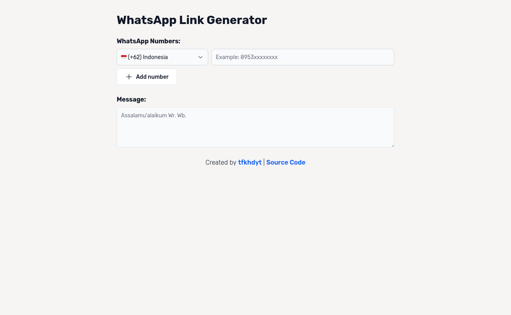
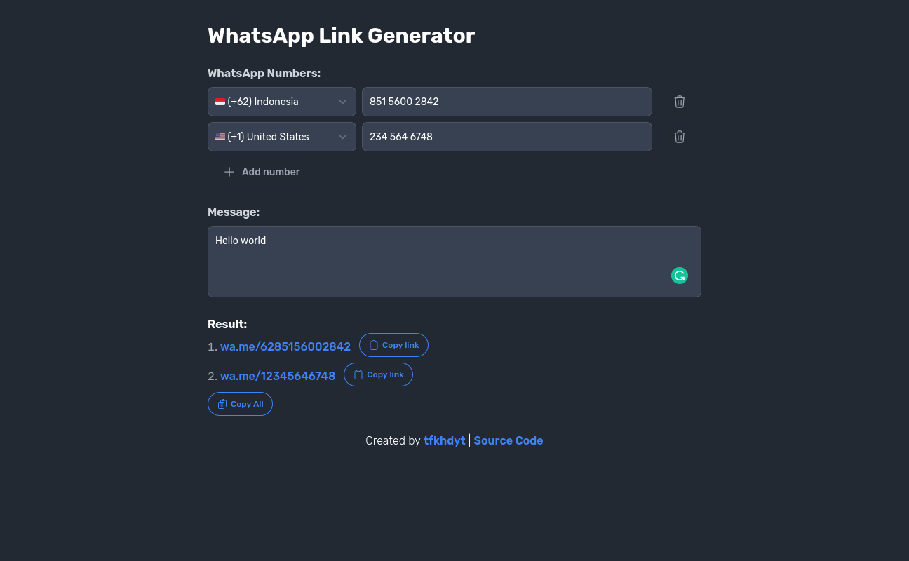

# WhatsApp Link Generator

Web app to generate WhatsApp contact link with default message easily

## Features

- Multi-country support
- Phone number validation by country
- Click to copy link
- Copy all links
- Free and Open Source
- No ads
- Dark mode (depends on your current browser theme)
- Lightweight

## Built with

- SvelteKit
- TypeScript
- Tailwind CSS
- Flowbite

## Preview





## Getting Started

### Prerequisites

- Node.js
- Node.js Package Manager (_pnpm_ is highly recommended)

### Installation

```sh
git clone https://github.com/tfkhdyt/whatsapp-link-generator
cd whatsapp-link-generator
pnpm i
pnpm dev
```

### Usage

- Run in development mode

```sh
pnpm dev
```

- Build project

```sh
pnpm build
```

- Run in production mode

```sh
pnpm preview
```

- Format the code (prettier)

```sh
pnpm format
```

- Lint the code (eslint)

```sh
pnpm lint
```
